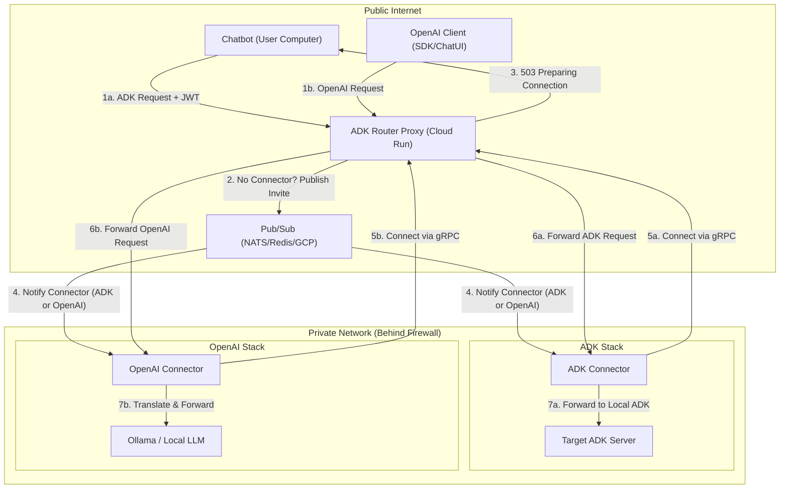

# ADK Server Router Proxy Specification

This document specifies the architecture and design for an ADK (Agent Development Kit) Server Router Proxy running on Google Cloud Run. This proxy enables chatbots and other clients to connect to ADK servers running behind firewalls via "Connectors" (reverse proxy agents) using a Just-In-Time (JIT) activation model.

## Design Refinement

**Current limitation**  
The connector always initiates a persistent connection to an **ADK Proxy** running on Cloud Run.

This design creates two main problems:

- It prevents ADK Proxy instances from **scaling to zero** (they must stay running to accept connections).  
- New ADK Proxy instances cannot route traffic back to a connector that lives on a different instance.

**Proposed solution: Just-in-Time (JIT) connector**  
Switch to a **pull/event-driven model** instead of proactive persistent connections.

**How the JIT connector works**

1. The connector **no longer** proactively connects to an ADK Proxy.  
   Instead, it listens passively for events via **Pub/Sub**.

2. When a **Chat Client** connects to an ADK Proxy:  
   - The proxy first checks whether any connector for the same **AppID** is already connected.  
   - **If yes** → open another session and tunnel it through the existing connector.  
   - **If no** →  
     - Immediately reply to the chat client:  
       *"Please wait, preparing connection..."*  
     - Publish a message to **Pub/Sub** inviting a connector to connect to *this specific ADK Proxy instance*.

3. The connector (listening on Pub/Sub) receives the invitation → establishes a connection to that ADK Proxy instance → the tunnel is ready.

4. **Idle timeout & shutdown**  
   When no ADK Proxy is connected anymore, the connector waits for a configurable time → then **gracefully shuts down**.

**Key requirements for the new design**

- A single connector instance must handle **multiple sessions** (for the same AppID).  
- Multiple connectors must be able to run across different ADK Proxy instances (horizontal scaling support).  
- Pub/Sub configuration (topic, subscription, project, etc.) should be read from a **config.yaml** file.  
- Include a registry / discovery mechanism for the Pub/Sub service.

This JIT approach allows true **scale-to-zero** for both ADK Proxy and connectors, reduces idle resource usage, and supports multi-instance routing cleanly.


## 1. Overview

The system facilitates communication between a client (e.g., a chatbot) and a target ADK or OpenAI server in a private network. To support Cloud Run's scale-to-zero and multi-instance nature, it uses a Pub/Sub-based JIT activation mechanism.

### 1.1 Architecture Diagram



## 2. Components

### 2.1 ADK Router Proxy (Cloud Run)
- **Responsibilities:**
    - **Authentication:** Authenticate clients and connectors using NATS NKey JWTs or EdDSA OAuth JWTs. Supports pluggable validation strategies (`single_key`, `multi_key`) via a handcrafted registry.
    - **Single-Port Multiplexing:** Exposes both ADK and OpenAI APIs on a single port (default `8080`) to comply with Cloud Run requirements.
    - **JIT Activation:** If no connector is registered for a `(userid, appid)`, publish an `InviteMessage` to Pub/Sub and return a "preparing connection" status.
    - Maintain a registry of active Connector streams.
    - Forward requests through the appropriate gRPC tunnel.
    - **OpenAI Translation:** Provide an OpenAI-compatible API surface (`/v1/chat/completions`) that translates requests to the ADK protocol for internal routing.
- **Config:** Loaded via `config.yaml` (Pub/Sub type/config, Proxy URL, OpenAI defaults).

### 2.2 ADK Connector (Reactive Agent)
- **Responsibilities:**
    - **Reactive Connection:** Listen for `InviteMessage` on Pub/Sub (`invites.<appid>`).
    - Establish outbound gRPC tunnels only when invited or when active sessions exist.
    - Forward raw ADK requests to a local ADK server.

### 2.3 OpenAI Connector (Reactive Agent)
- **Responsibilities:**
    - **Reactive Connection:** Listen for `InviteMessage` on Pub/Sub (`invites.<appid>`).
    - **Translation Layer:** Intercepts ADK requests (`/apps/.../run_sse`) from the tunnel and translates them into OpenAI-compatible requests for local services like Ollama.
    - **Streaming Translation:** Translates Ollama's OpenAI-compatible SSE stream back into ADK-compatible SSE events for the Proxy.

### 2.4 Pub/Sub Registry
A flexible abstraction layer (`pkg/pubsub`) supporting:
- **NATS:** Lightweight, ideal for low-latency signaling.
- **Redis:** Common for Cloud Run via Memorystore.
- **Google Cloud Pub/Sub:** Native GCP serverless messaging.

## 3. Just-In-Time (JIT) Activation Flow

1. **Client Request:** A request hits any Proxy instance.
2. **Registry Lookup:** Proxy checks its local in-memory registry.
3. **Invite:** If missing, Proxy publishes an `InviteMessage` containing its own `ProxyURL`.
4. **Retry Signal:** Proxy returns `503 Service Unavailable` with the message "please wait, preparing connection".
5. **Connector Activation:** The Connector receives the invite and dials the specific `ProxyURL`.
6. **Subsequent Requests:** The client retries, finds the active connection, and the request is tunneled.

## 4. Authentication & Security
- **ADK Clients:** NATS NKey JWTs or EdDSA OAuth JWTs.
- **Connectors:** NATS NKey JWTs.
- **OpenAI Clients:** Static API Key (mapped to a valid ADK JWT internally by the Router Proxy).

## 5. Protocols
- **Client <-> Proxy (ADK):**
    - `POST /apps/{app}/users/{user}/sessions`: Create session.
    - `POST /apps/{app}/users/{user}/sessions/{session}/run_sse`: Run agent (SSE).
- **Client <-> Proxy (OpenAI):**
    - `POST /v1/chat/completions`: OpenAI Chat Completions API.
    - `GET /v1/models`: List available models (AppIDs).
- **Connector <-> Proxy:** gRPC Bi-directional Stream.
- **Control Plane:** Pub/Sub (JSON encoded `InviteMessage`).

## 6. Deployment & Configuration

### 6.1 config.yaml
The system requires a `config.yaml` in the working directory:
```yaml
pubsub:
  type: "nats" # or "redis", "gcp"
  config:
    url: "nats://localhost:4222"
proxy:
  url: "https://router-proxy-xyz.a.run.app" # The external URL of the Proxy
openai:
  default_app_id: "ollama"
  default_user_id: "openai-user"
```
