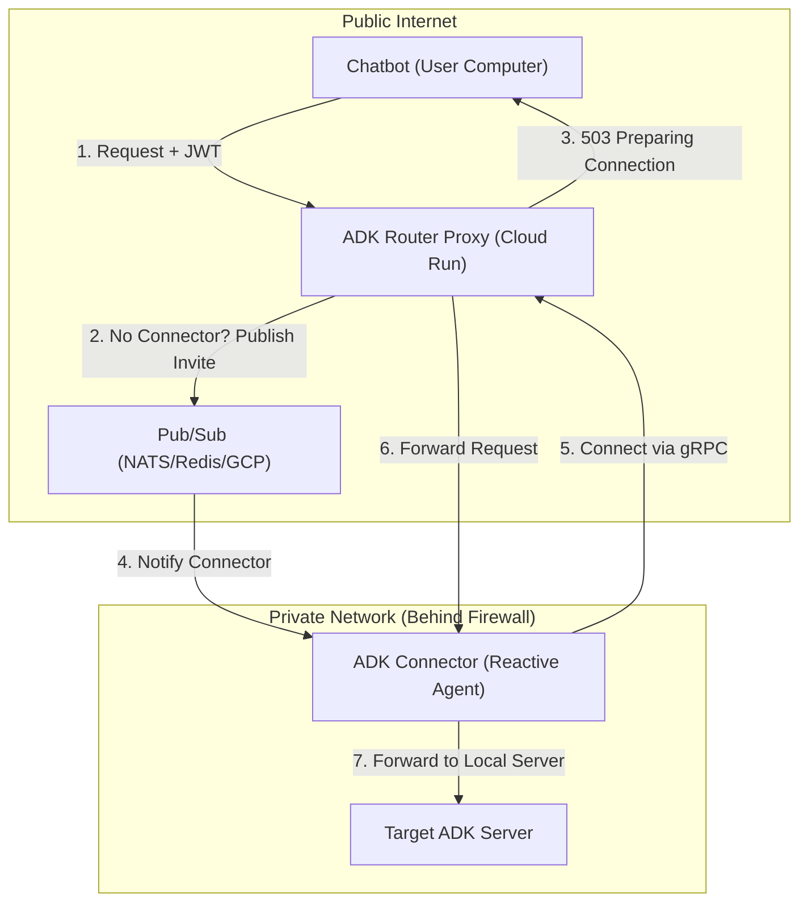

# ADK Server Router Proxy Specification

This document specifies the architecture and design for an ADK (Agent Development Kit) Server Router Proxy running on Google Cloud Run. This proxy enables chatbots and other clients to connect to ADK servers running behind firewalls via "Connectors" (reverse proxy agents) using a Just-In-Time (JIT) activation model.

## 1. Overview

The system facilitates communication between a client (e.g., a chatbot) and a target ADK server in a private network. To support Cloud Run's scale-to-zero and multi-instance nature, it uses a Pub/Sub-based JIT activation mechanism.

### 1.1 Architecture Diagram



## 2. Components

### 2.1 ADK Router Proxy (Cloud Run)
- **Responsibilities:**
    - Authenticate clients and connectors.
    - **JIT Activation:** If no connector is registered for a `(userid, appid)`, publish an `InviteMessage` to Pub/Sub and return a "preparing connection" status.
    - Maintain a registry of active Connector streams.
    - Forward requests through the appropriate gRPC tunnel.
- **Config:** Loaded via `config.yaml` (Pub/Sub type/config, Proxy URL).

### 2.2 ADK Connector (Reactive Agent)
- **Responsibilities:**
    - **Reactive Connection:** Listen for `InviteMessage` on Pub/Sub (`invites.<appid>`).
    - Establish outbound gRPC tunnels only when invited or when active sessions exist.
    - **Multi-Proxy Support:** Can maintain concurrent connections to different Proxy instances.
    - **Graceful Shutdown:** Monitors activity and shuts down after 10 minutes of total inactivity (5 minutes for closing idle tunnels).

### 2.3 Pub/Sub Registry
A flexible abstraction layer (`pkg/pubsub`) supporting:
- **NATS:** Lightweight, ideal for low-latency signaling.
- **Redis:** Common for Cloud Run via Memorystore.
- **Google Cloud Pub/Sub:** Native GCP serverless messaging.

## 3. Just-In-Time (JIT) Activation Flow

1. **Client Request:** A request hits any Proxy instance.
2. **Registry Lookup:** Proxy checks its local in-memory registry.
3. **Invite:** If missing, Proxy publishes an `InviteMessage` containing its own `ProxyURL`.
4. **Retry Signal:** Proxy returns `503 Service Unavailable` with the message "please wait, preparing connection".
5. **Connector Activation:** The Connector receives the invite and dials the specific `ProxyURL`.
6. **Subsequent Requests:** The client retries, finds the active connection, and the request is tunneled.

## 4. Authentication & Security
(Retained from previous specification: NATS NKey JWTs and EdDSA OAuth JWTs).

## 5. Protocols
- **Client <-> Proxy:** HTTP/gRPC (ADK Protocol).
- **Connector <-> Proxy:** gRPC Bi-directional Stream.
- **Control Plane:** Pub/Sub (JSON encoded `InviteMessage`).

## 6. Deployment & Configuration

### 6.1 config.yaml
The system requires a `config.yaml` in the working directory:
```yaml
pubsub:
  type: "nats" # or "redis", "gcp"
  config:
    url: "nats://localhost:4222"
proxy:
  url: "https://router-proxy-xyz.a.run.app" # The external URL of the Proxy
```
