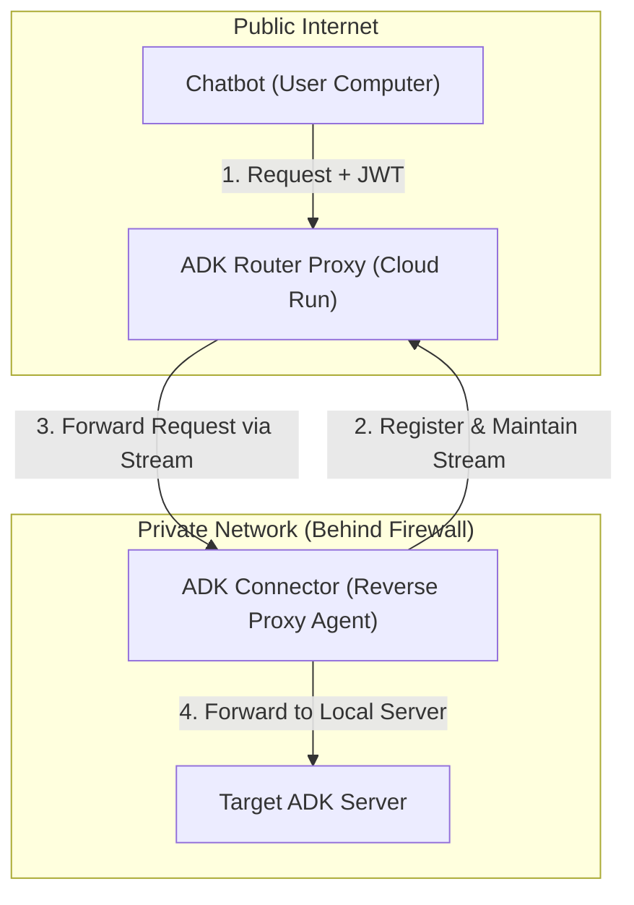

# ADK Server Router Proxy Specification

This document specifies the architecture and design for an ADK (Agent Development Kit) Server Router Proxy running on Google Cloud Run. This proxy enables chatbots and other clients to connect to ADK servers running behind firewalls via "Connectors" (reverse proxy agents).

## 1. Overview

The system facilitates communication between a client (e.g., a chatbot on a user's computer) and a target ADK server located in a private network. The core component is the **Router Proxy**, which acts as a centralized routing hub.

### 1.1 Architecture Diagram



## 2. Components

### 2.1 ADK Router Proxy (Cloud Run)
The Router Proxy is the entry point for all client requests.
- **Responsibilities:**
    - Authenticate clients and connectors using NATS JWTs signed with Ed25519 NKeys.
    - Maintain a registry of active Connector connections.
    - Extract routing metadata (`userid`, `appid`, `session`) from JWT claims.
    - Forward ADK requests to the appropriate Connector.
- **Logging:** Structured logging via `log/slog`. On Cloud Run, outputs JSON to stdout with fields mapped for Google Cloud Logging (`severity`, `message`, `timestamp`). Locally, outputs human-readable text to stderr.
- **Tech Stack:** Go, ADK Go SDK, `github.com/nats-io/jwt/v2`, `github.com/nats-io/nkeys`.

### 2.2 ADK Connector (Reverse Proxy Agent)
The Connector runs in the same private network as the target ADK server.
- **Responsibilities:**
    - Establish an outbound connection to the Router Proxy.
    - Authenticate using its own NKey-signed JWT.
    - Keep a bi-directional gRPC stream open to receive forwarded requests.
    - Act as an ADK client to forward requests to the local ADK server.
    - Return responses back through the stream.

### 2.3 ADK2Goose Connector
A variant of the ADK Connector that bridges ADK clients to a [Goose](https://github.com/block/goose) agent server instead of a standard ADK server.
- **Responsibilities:**
    - Establish an outbound gRPC tunnel to the Router Proxy (same as the ADK Connector).
    - Authenticate using its own NKey-signed JWT.
    - Embed an ADK-to-Goose translation layer that converts ADK REST API requests into Goose API calls.
    - Manage Goose agent sessions (start, stop, session mapping).
    - Translate Goose SSE streaming responses back into ADK event format.
    - Return translated responses back through the tunnel.

### 2.4 Chatbot / Client
Any application using the ADK protocol that needs to reach a remote agent.
- **Responsibilities:**
    - Generate a JWT signed with an NKey.
    - Include required claims for routing.
    - Send requests to the Router Proxy endpoint.

## 3. Authentication & Security

The Router Proxy supports **two JWT authentication mechanisms**:

1. **NATS NKey JWTs** — used by Connectors and programmatic Chatbot clients (existing).
2. **EdDSA OAuth JWTs** — used by the SPA (`a2ui-chat-ts`), issued by the WhatsApp Gateway (`whatsadk`) acting as an Identity Provider (new).

### 3.1 NATS NKey JWTs (Connectors & Chatbots)

Authentication uses Ed25519 signatures via NKeys (`nats-io/jwt/v2`, `nats-io/nkeys`).
- **Issuer:** A trusted authority (Operator/Account) that signs the JWTs.
- **Verification:** The Router Proxy validates the signature using the Issuer's Public Key.
- **Libraries:** `github.com/nats-io/jwt/v2`, `github.com/nats-io/nkeys`.

#### 3.1.1 NATS JWT Claims
The JWT MUST include the following claims for routing:
- `sub` (Subject): The identity of the requester.
- `iss` (Issuer): The public key of the signer.
- `userid`: Custom claim identifying the user.
- `appid`: Custom claim identifying the application.
- `sessionid`: (Optional) For session-affinity routing.

#### 3.1.2 Connector Authentication
Connectors also authenticate with NATS JWTs. The Router Proxy uses the `userid` and `appid` claims in the Connector's JWT to register it in the routing table.

### 3.2 EdDSA OAuth JWTs (SPA / WhatsApp OAuth)

The SPA authenticates users via the WhatsApp Gateway's OAuth flow. The gateway issues standard JWTs signed with Ed25519 (`alg: EdDSA`) using `golang-jwt/jwt/v5`.

- **Issuer:** The WhatsApp Gateway (`whatsadk-gateway`).
- **Audience:** This service (`adk-cloud-proxy`).
- **Verification:** The Router Proxy validates the EdDSA signature using the gateway's Ed25519 public key, provided via the `OAUTH_PUBLIC_KEY` environment variable (base64url-encoded 32-byte raw public key).
- **Libraries:** `golang-jwt/jwt/v5`, `crypto/ed25519` (Go stdlib).

#### 3.2.1 EdDSA OAuth JWT Claims

```json
{
  "alg": "EdDSA",
  "typ": "JWT"
}
.
{
  "sub": "919876543210",
  "iss": "whatsadk-gateway",
  "aud": "adk-cloud-proxy",
  "iat": 1700000000,
  "exp": 1700086400,
  "nonce": "a1b2c3d4e5f6g7h8",
  "pubkey": "base64url-encoded-ed25519-public-key"
}
```

- `sub`: The authenticated phone number — used as the **userid** for routing.
- `iss`: Must match the expected gateway issuer identifier.
- `aud`: Must match this service's identifier.
- `exp`: Default 24-hour expiry (set by the gateway, configurable).
- `nonce`: Binds the token to the originating SPA instance (not verified by this service).
- `pubkey`: The SPA's ephemeral Ed25519 public key (not verified by this service).

#### 3.2.2 Claim Mapping for Routing

When the Router Proxy receives an EdDSA OAuth JWT (detected by `alg: EdDSA` and standard JWT structure vs NATS JWT structure):
- `userid` is derived from the `sub` claim (the phone number).
- `appid` must be provided by the SPA in a request header or query parameter (e.g., `X-App-ID` header), since the OAuth JWT does not contain an `appid` claim.
- `sessionid` is provided by the SPA in the ADK request body (as per standard ADK protocol).

### 3.3 Token Discrimination

The Router Proxy distinguishes between the two JWT types:
1. **NATS JWTs** use a dot-separated format with NKey-specific header fields. They are decoded via `jwt.DecodeGeneric()` from `nats-io/jwt/v2`.
2. **EdDSA OAuth JWTs** are standard RFC 7519 JWTs with `"alg": "EdDSA"` in the header. They are decoded via `golang-jwt/jwt/v5` with an `ed25519.PublicKey` verifier.

The auth middleware attempts NATS JWT validation first; if that fails (e.g., signature mismatch or format error), it falls back to EdDSA OAuth JWT validation (only if `OAUTH_PUBLIC_KEY` is configured).

## 4. Routing Logic

The Router Proxy maintains an in-memory map:
`Map[(userid, appid)] -> ActiveStream`

1. **Connector Registration:** When a Connector connects, it sends its JWT. The Proxy validates it and stores the gRPC stream associated with the `userid` and `appid`.
2. **Request Handling:** When a Chatbot sends a request, the Proxy:
    - Verifies the Chatbot's JWT.
    - Extracts `userid` and `appid`.
    - Looks up the `ActiveStream` in the map.
    - If found, it wraps the ADK request and sends it through the stream.
    - If not found, it returns a `404 Not Found` or `503 Service Unavailable`.

## 5. Protocols

- **Client <-> Router Proxy:** HTTP/gRPC (Standard ADK/A2A Protocol).
- **Connector <-> Router Proxy:** gRPC Bi-directional Stream (Custom "Tunnel" Service).
- **Connector <-> Target ADK Server:** HTTP/gRPC (Standard ADK/A2A Protocol).

## 6. Deployment

### 6.1 Google Cloud Run
- The Router Proxy is deployed as a Cloud Run service.
- **Configuration:**
    - HTTP/2 must be enabled for gRPC streams.
    - NATS Authentication Public Keys should be provided via environment variables or Secret Manager.
    - `OAUTH_PUBLIC_KEY`: *(Optional)* Base64url-encoded Ed25519 public key of the WhatsApp Gateway. Enables SPA OAuth authentication when set.
    - `OAUTH_ISSUER`: *(Optional)* Expected `iss` claim value (default: `whatsadk-gateway`).
    - `OAUTH_AUDIENCE`: *(Optional)* Expected `aud` claim value (default: `adk-cloud-proxy`).

### 6.2 Connector Configuration
- The Connector requires:
    - `ROUTER_PROXY_URL`: Endpoint of the Cloud Run service.
    - `NKEY_SEED`: Its private seed for signing its own JWT.
    - `TARGET_ADK_SERVER_URL`: Local URL of the agent it proxies for.

### 6.3 ADK2Goose Connector Configuration
- The ADK2Goose Connector requires:
    - `ROUTER_PROXY_URL`: Endpoint of the Cloud Run service.
    - `NKEY_SEED`: Its private seed for signing its own JWT.
    - `USER_ID`: User identifier for routing.
    - `APP_ID`: Application identifier for routing.
    - `GOOSE_BASE_URL`: URL of the Goose server (default: `http://127.0.0.1:3000`).
    - `GOOSE_SECRET_KEY`: *(Optional)* Secret key for Goose API authentication.
    - `WORKING_DIR`: *(Optional)* Working directory for Goose agent sessions (default: `.`).
